## 概览

官方简介：[Android-Graphics](https://source.android.com/devices/graphics)

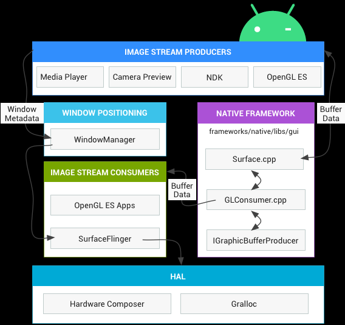

- Image Stream Producers：图形生产者，用来生成图形缓冲区，以供图形消费者使用。例如OpenGL ES、Canvas 2D 和 mediaserver 视频解码器。
- Native Framework：Libgui库，包含了图形系统底层的基本元素，例如Surface、BufferQueue、GraphicBufferConsumer、GraphicBufferProducer、SurfaceComposer等等。
- Window Positioning：WindowManager，用来控制 window 对象，window为一组view对象的集合。它为 SurfaceFlinger 提供缓冲区和窗口元数据，而 SurfaceFlinger 可使用这些信息将 Surface 合成到屏幕。
- Image Stream Consumers：图形消费者，包括 SurfaceFlinger 和一些图形应用。

  - 图形流的最常见消费者是 SurfaceFlinger，该系统服务会消耗当前可见的 Surface，并使用 WindowManager 中提供的信息将它们合成到显示部分。SurfaceFlinger 使用 OpenGL 和 Hardware Composer 来合成一组 Surface。
  - 一些 OpenGL ES 应用也可以做为消费者，例如相机应用会消费相机预览图像流。非 GL 应用也可以是消费者，例如 ImageReader 类。
- HAL：显示子系统的硬件抽象实现，包括 Hardware Composer 和 Gralloc。

  - SurfaceFlinger 可以将某些合成工作委托给 Hardware Composer，以分担 OpenGL 和 GPU 上的工作量。这时，SurfaceFlinger 只是充当另一个 OpenGL ES 客户端，Hardware Composer 则进行图形渲染的工作。Hardware Composer 必须支持事件，其中之一是 VSYNC（另一个是支持即插即用 HDMI 的热插拔）。
  - Gralloc用来分配图形生产方请求的内存。

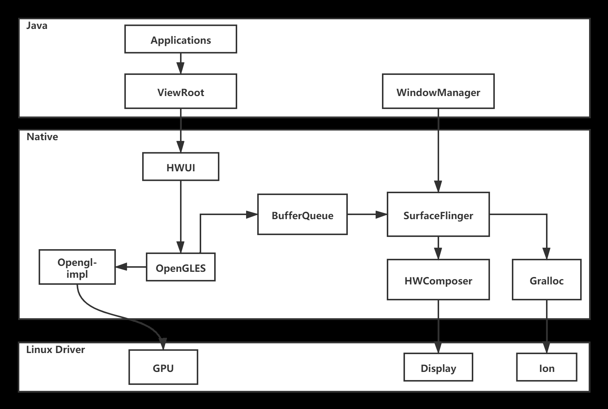

## BufferQueue

官方简介：[Android-BufferQueue](https://source.android.com/devices/graphics/arch-bq-gralloc)

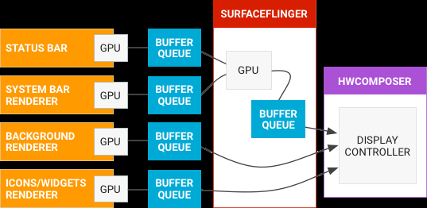

左侧的对象是生成图形缓冲区的渲染器，如主屏幕、状态栏和系统界面。SurfaceFlinger 是合成器，而 Hardware Composer 是制作器。BufferQueue 是 Android 图形系统很重要的组成部分，它负责数据的传递：

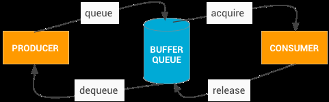

图中的 producer 和 consumer 运行在不同的进程里，BufferQueue 是将缓冲区池与队列相结合的数据结构，它使用 Binder IPC 在进程之间传递缓冲区。几个重要函数如下：

- producers 通过 BufferQueue 请求一块空闲的缓存区(GraphicBuffer): IGraphicBufferProducer.dequeueBuffer 方法
- 往缓存区(GraphicBuffer)填充了数据(绘制等)后, producers 将缓存区(GraphicBuffer)入队列到 BufferQueue 中: IGraphicBufferProducer.queueBuffer 方法
- consumer 从 BufferQueue 中出队列一块缓存区(GraphicBuffer): IGraphicBufferConsumer.acquireBuffer 方法
- consumer 消费完毕后(典型的是 SurfaceFlinger 合成数据)将缓存区(GraphicBuffer)返回给队列: IGraphicBufferConsumer.releaseBuffer 方法

其中 IGraphicBufferProducer 是 BufferQueue 的生产者接口，实现类是 BufferQueueProducer 生产者类；IGraphicBufferConsumer 是 BufferQueue 的消费者接口，实现类是 BufferQueueConsumer 消费者类。

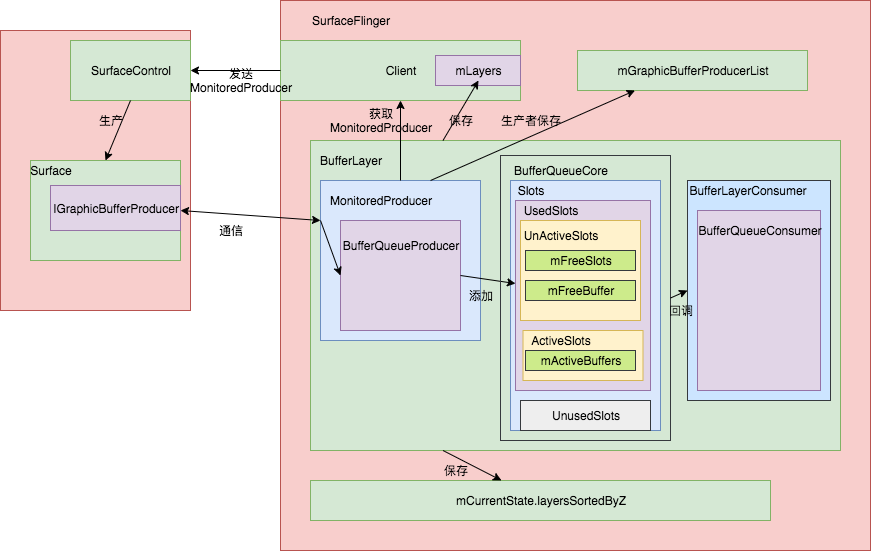

## SurfaceFlinger

SurfaceFlinger 用来管理消费当前可见的 Surface, 所有被渲染的可见 Surface 都会被 SurfaceFlinger 通过 WindowManager 提供的信息合成(使用 OpenGL 和 HardWare Composer)提交到屏幕的后缓冲区，等待屏幕的下一个 Vsync 信号到来，再显示到屏幕上。SufaceFlinger 通过屏幕后缓冲区与屏幕建立联系，同时通过 Surface 与上层建立联系，起到了一个承上启下的作用。

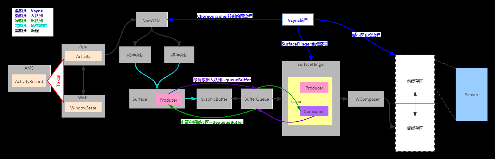

SurfaceFlinger工作流程

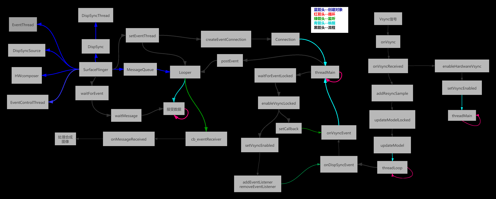

SurfaceFlinger的registerCallback时的**this**就是SurfaceFlinger对ComposerCallback接口的实现。

- onHotplugReceived

  热插拔事件，显示屏幕连接或者断开时回调
- onRefreshReceived

  接收底层HWComposer的刷新请求，实现方法如下：

  ```cpp

  void SurfaceFlinger::onRefreshReceived(int sequenceId,

                                         hwc2_display_t /*display*/) {

      Mutex::Autolock lock(mStateLock);

      if (sequenceId !=getBE().mComposerSequenceId) {

          return;

      }

      repaintEverythingLocked();

  }


  void SurfaceFlinger::repaintEverythingLocked() {

      android_atomic_or(1, &mRepaintEverything);

      //触发刷新，重新合成显示

      signalTransaction();

  }

  ```
  
- onVsyncReceived

  Vsync事件上报，接收底层硬件上报的垂直同步信号。

为什么需要垂直同步信号，参考<https://juejin.cn/post/6863756420380196877#heading-1>

### 合成方式

- Client合成

将各个Layer的内容用GPU渲染到暂存缓冲区中，最后将暂存缓冲区传送到显示硬件，Client合成，采用RenderEngine进行合成

- Device合成

硬件合成器进行合成HWComposer，其合成方式是将各个Layer的数据全部传给显示硬件，并告知它从不同的缓冲区读取屏幕不同部分的数据

#### HWC相关图表

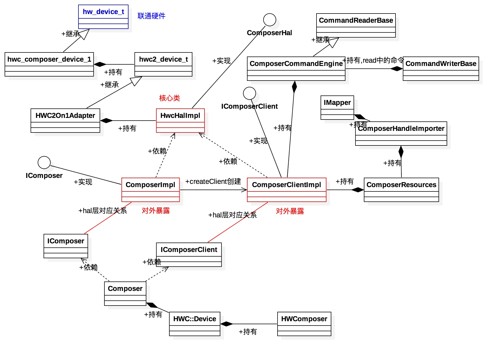

#### 合成图表

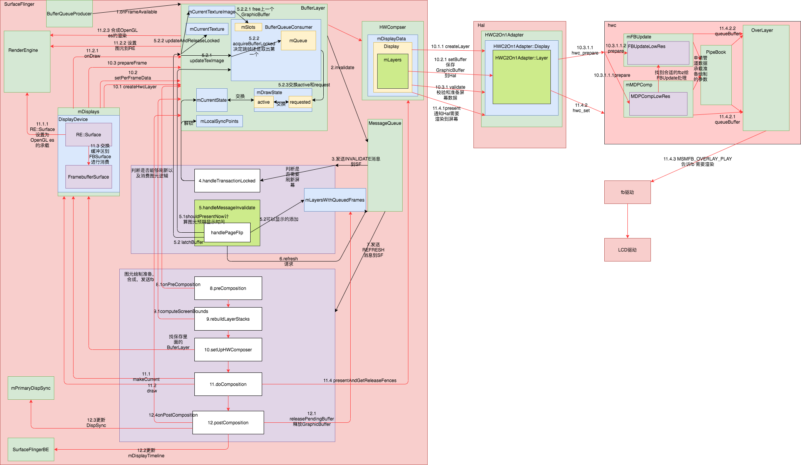

### Dump信息

`adb shell dumpsys SurfaceFlinger`

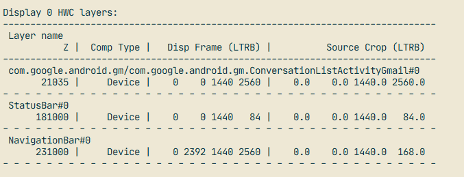

### 图层

图层（Layer）是合成的最重要单元；每个图层都有一组属性，用于定义它与其他层的交互方式。Layer在每一层中的代码的实现不一样，基本上Laye的理念都是一样的。

```cpp

frameworks/native/services/surfaceflinger

├── Layer.h

├── Layer.cpp

├── ColorLayer.h

├── ColorLayer.cpp

├── BufferLayer.h

└── BufferLayer.cpp

```

## 总结

整个图形显示系统可以简单地分为图形和显示两个系统理解。

- 图形系统，提供绘图和图形处理的支持。无论是2D的Skia，还是3D的OpenGLES，还有各种图片解吗库
- 显示系统，图形绘制好后，需要显示，就需要合并窗口，这个时候就需要用到Surfaceflinger，上层的显示系统有View、ActivityManagerService和WindowManagerService组成。一个窗口就是一个Surface，Surfacedlinger使用Layer去描述一个窗口。

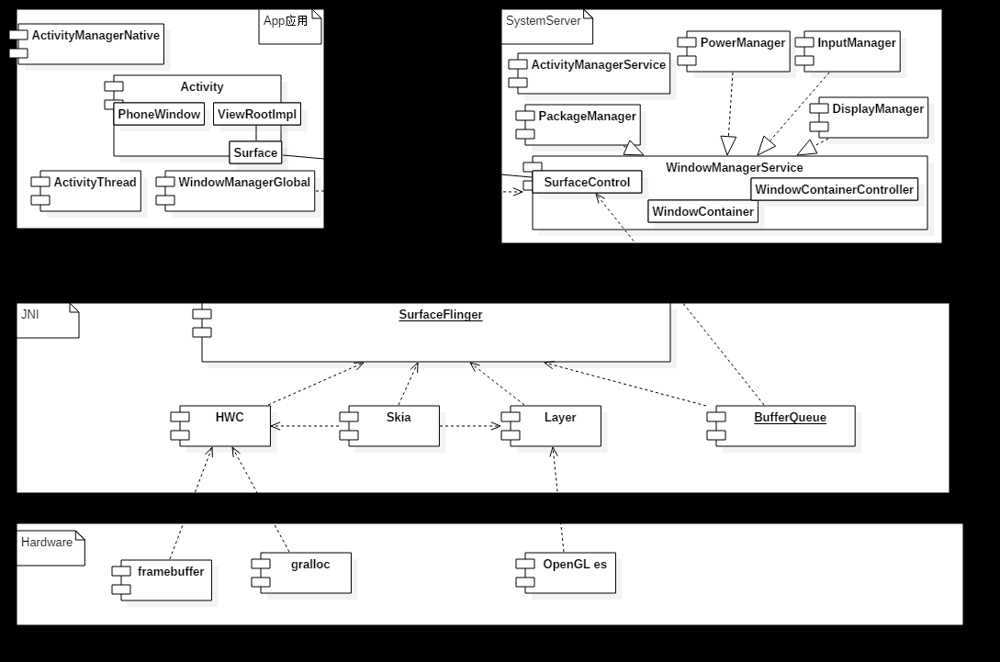
